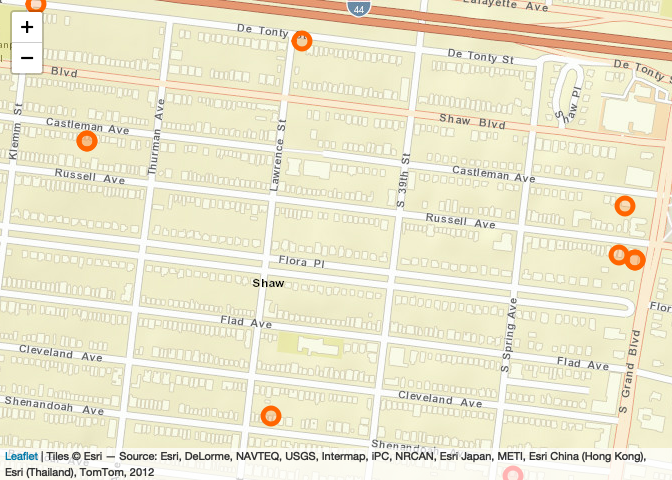
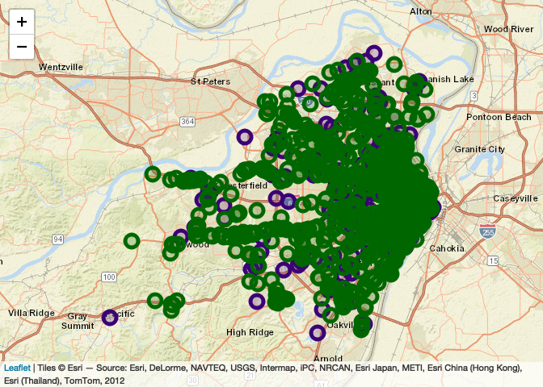
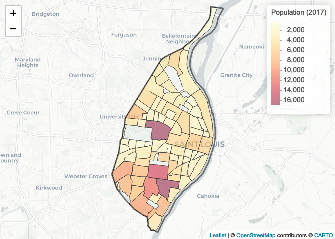
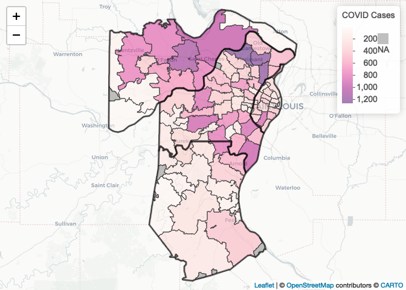

GIS-02 - More with Leaflet - Complete
================
Christopher Prener, Ph.D.
(September 09, 2020)

## Introduction

This notebook extends our `leaflet` experience to include both
multi-layer maps as well as thematic choropleth maps.

## Dependencies

This notebook requires a variety of packages for working with spatial
data:

``` r
# tidyverse packages
library(dplyr)        # data wrangling
```

    ## Warning: package 'dplyr' was built under R version 4.0.2

    ## 
    ## Attaching package: 'dplyr'

    ## The following objects are masked from 'package:stats':
    ## 
    ##     filter, lag

    ## The following objects are masked from 'package:base':
    ## 
    ##     intersect, setdiff, setequal, union

``` r
# spatial packages
library(leaflet)      # interactive maps
library(mapview)      # preview spatial data
```

    ## Warning: package 'mapview' was built under R version 4.0.2

    ## GDAL version >= 3.1.0 | setting mapviewOptions(fgb = TRUE)

``` r
library(sf)           # spatial data tools
```

    ## Warning: package 'sf' was built under R version 4.0.2

    ## Linking to GEOS 3.8.1, GDAL 3.1.1, PROJ 6.3.1

``` r
library(tigris)       # TIGER/Line data access
```

    ## To enable 
    ## caching of data, set `options(tigris_use_cache = TRUE)` in your R script or .Rprofile.

``` r
# other packages
library(here)         # file path management
```

    ## here() starts at /Users/prenercg/GitHub/DSS/gis-02

``` r
library(RColorBrewer) # color palettes
```

## Load Data

First, we need to load up our data. This is review from the first
session, and so we’ve pre-filled the code for you. We’ll automatically
re-project the data as well (also review):

``` r
# point data 1 - Violent Crime in the Shaw Neighborhood
shawCrime <- st_read(here("data", "SHAW_Violent_2018", "SHAW_Violent_2018.shp")) %>%
  st_transform(crs = 4326)
```

    ## Reading layer `SHAW_Violent_2018' from data source `/Users/prenercg/GitHub/DSS/gis-02/data/SHAW_Violent_2018/SHAW_Violent_2018.shp' using driver `ESRI Shapefile'
    ## Simple feature collection with 23 features and 8 fields
    ## geometry type:  POINT
    ## dimension:      XY
    ## bbox:           xmin: -90.25692 ymin: 38.60956 xmax: -90.24046 ymax: 38.61747
    ## geographic CRS: GRS 1980(IUGG, 1980)

``` r
# point data 2 - Food Retail in St. Louis
grocery <- st_read(here("data", "STL_FOOD_Grocery.geojson")) 
```

    ## Reading layer `grocery' from data source `/Users/prenercg/GitHub/DSS/gis-02/data/STL_FOOD_Grocery.geojson' using driver `GeoJSON'
    ## Simple feature collection with 685 features and 5 fields
    ## geometry type:  POINT
    ## dimension:      XY
    ## bbox:           xmin: -90.69589 ymin: 38.46747 xmax: -90.18662 ymax: 38.82457
    ## geographic CRS: WGS 84

``` r
cornerStore <- st_read(here("data", "STL_FOOD_Convenience.geojson"))
```

    ## Reading layer `convenience' from data source `/Users/prenercg/GitHub/DSS/gis-02/data/STL_FOOD_Convenience.geojson' using driver `GeoJSON'
    ## Simple feature collection with 230 features and 5 fields
    ## geometry type:  POINT
    ## dimension:      XY
    ## bbox:           xmin: -90.73367 ymin: 38.46321 xmax: -90.18353 ymax: 38.83523
    ## geographic CRS: WGS 84

``` r
# polygon data 1 - St. Louis Neighborhood Population
nhood <- st_read(here("data", "STL_DEMOS_Nhoods", "STL_DEMOS_Nhoods.shp")) %>%
  st_transform(crs = 4326)
```

    ## Reading layer `STL_DEMOS_Nhoods' from data source `/Users/prenercg/GitHub/DSS/gis-02/data/STL_DEMOS_Nhoods/STL_DEMOS_Nhoods.shp' using driver `ESRI Shapefile'
    ## Simple feature collection with 79 features and 6 fields
    ## geometry type:  MULTIPOLYGON
    ## dimension:      XY
    ## bbox:           xmin: 733361.8 ymin: 4268512 xmax: 745417.9 ymax: 4295501
    ## projected CRS:  UTM_Zone_15_Northern_Hemisphere

``` r
# polygon data 2 - St. Louis COVID Cases by ZIP Code
covid <- st_read(here("data", "daily_snapshot_regional.geojson"))
```

    ## Reading layer `daily_snapshot_regional' from data source `/Users/prenercg/GitHub/DSS/gis-02/data/daily_snapshot_regional.geojson' using driver `GeoJSON'
    ## Simple feature collection with 106 features and 6 fields
    ## geometry type:  MULTIPOLYGON
    ## dimension:      XY
    ## bbox:           xmin: -90.96446 ymin: 38.0035 xmax: -90.10911 ymax: 38.96777
    ## geographic CRS: WGS 84

Now, take a few moments using your *console* and explore each of these
data sets using the `mapview()` function\!

## Download a Bit of Extra Data

We’ll supplement the data we’ve loaded with some boundary data for a
four county region in the St. Louis area (the City, the County,
St. Charles County, and Jefferson County).

We’ll use the `tigris` package to do this. Using `tigris`, you can
download most of the common spatial data sets published by the U.S.
Census Bureau that reflect both administrative boundaries as well as
elements of our physical and human geography. However, this package
cannot be used to download population data (that is the purpose of
`tidycensus`).

The pipelines read as follows:

1.  We’ll assign to our new object `region` the result of the following
    pipeline.
2.  First, we’ll download county boundaries for Missouri (FIPS Code 29),
    *then*
3.  We’ll select the `GEOID` and `NAMELSAD` columns using the `dplyr`
    `select()` function, *then*
4.  We’ll keep only the observations that match the GEOID codes for the
    select counties using the `dplyr` `filter()` function, *then*
5.  We’ll re-project our data.

<!-- end list -->

``` r
region <- counties(state = 29) %>%
  select(GEOID, NAMELSAD) %>%
  filter(GEOID %in% c("29099", "29183", "29189", "29510")) %>%
  st_transform(crs = 4326)
```

    ##   |                                                                              |                                                                      |   0%  |                                                                              |                                                                      |   1%  |                                                                              |=                                                                     |   1%  |                                                                              |=                                                                     |   2%  |                                                                              |==                                                                    |   2%  |                                                                              |==                                                                    |   3%  |                                                                              |==                                                                    |   4%  |                                                                              |===                                                                   |   4%  |                                                                              |===                                                                   |   5%  |                                                                              |====                                                                  |   5%  |                                                                              |====                                                                  |   6%  |                                                                              |=====                                                                 |   6%  |                                                                              |=====                                                                 |   7%  |                                                                              |=====                                                                 |   8%  |                                                                              |======                                                                |   8%  |                                                                              |======                                                                |   9%  |                                                                              |=======                                                               |   9%  |                                                                              |=======                                                               |  10%  |                                                                              |=======                                                               |  11%  |                                                                              |========                                                              |  11%  |                                                                              |========                                                              |  12%  |                                                                              |=========                                                             |  12%  |                                                                              |=========                                                             |  13%  |                                                                              |=========                                                             |  14%  |                                                                              |==========                                                            |  14%  |                                                                              |==========                                                            |  15%  |                                                                              |===========                                                           |  15%  |                                                                              |===========                                                           |  16%  |                                                                              |============                                                          |  16%  |                                                                              |============                                                          |  17%  |                                                                              |============                                                          |  18%  |                                                                              |=============                                                         |  18%  |                                                                              |=============                                                         |  19%  |                                                                              |==============                                                        |  19%  |                                                                              |==============                                                        |  20%  |                                                                              |==============                                                        |  21%  |                                                                              |===============                                                       |  21%  |                                                                              |===============                                                       |  22%  |                                                                              |================                                                      |  22%  |                                                                              |================                                                      |  23%  |                                                                              |================                                                      |  24%  |                                                                              |=================                                                     |  24%  |                                                                              |=================                                                     |  25%  |                                                                              |==================                                                    |  25%  |                                                                              |==================                                                    |  26%  |                                                                              |===================                                                   |  26%  |                                                                              |===================                                                   |  27%  |                                                                              |===================                                                   |  28%  |                                                                              |====================                                                  |  28%  |                                                                              |====================                                                  |  29%  |                                                                              |=====================                                                 |  29%  |                                                                              |=====================                                                 |  30%  |                                                                              |=====================                                                 |  31%  |                                                                              |======================                                                |  31%  |                                                                              |======================                                                |  32%  |                                                                              |=======================                                               |  32%  |                                                                              |=======================                                               |  33%  |                                                                              |=======================                                               |  34%  |                                                                              |========================                                              |  34%  |                                                                              |========================                                              |  35%  |                                                                              |=========================                                             |  35%  |                                                                              |=========================                                             |  36%  |                                                                              |==========================                                            |  36%  |                                                                              |==========================                                            |  37%  |                                                                              |==========================                                            |  38%  |                                                                              |===========================                                           |  38%  |                                                                              |===========================                                           |  39%  |                                                                              |============================                                          |  39%  |                                                                              |============================                                          |  40%  |                                                                              |============================                                          |  41%  |                                                                              |=============================                                         |  41%  |                                                                              |=============================                                         |  42%  |                                                                              |==============================                                        |  42%  |                                                                              |==============================                                        |  43%  |                                                                              |==============================                                        |  44%  |                                                                              |===============================                                       |  44%  |                                                                              |===============================                                       |  45%  |                                                                              |================================                                      |  45%  |                                                                              |================================                                      |  46%  |                                                                              |=================================                                     |  46%  |                                                                              |=================================                                     |  47%  |                                                                              |=================================                                     |  48%  |                                                                              |==================================                                    |  48%  |                                                                              |==================================                                    |  49%  |                                                                              |===================================                                   |  49%  |                                                                              |===================================                                   |  50%  |                                                                              |===================================                                   |  51%  |                                                                              |====================================                                  |  51%  |                                                                              |====================================                                  |  52%  |                                                                              |=====================================                                 |  52%  |                                                                              |=====================================                                 |  53%  |                                                                              |=====================================                                 |  54%  |                                                                              |======================================                                |  54%  |                                                                              |======================================                                |  55%  |                                                                              |=======================================                               |  55%  |                                                                              |=======================================                               |  56%  |                                                                              |========================================                              |  56%  |                                                                              |========================================                              |  57%  |                                                                              |========================================                              |  58%  |                                                                              |=========================================                             |  58%  |                                                                              |=========================================                             |  59%  |                                                                              |==========================================                            |  59%  |                                                                              |==========================================                            |  60%  |                                                                              |==========================================                            |  61%  |                                                                              |===========================================                           |  61%  |                                                                              |===========================================                           |  62%  |                                                                              |============================================                          |  62%  |                                                                              |============================================                          |  63%  |                                                                              |============================================                          |  64%  |                                                                              |=============================================                         |  64%  |                                                                              |=============================================                         |  65%  |                                                                              |==============================================                        |  65%  |                                                                              |==============================================                        |  66%  |                                                                              |===============================================                       |  66%  |                                                                              |===============================================                       |  67%  |                                                                              |===============================================                       |  68%  |                                                                              |================================================                      |  68%  |                                                                              |================================================                      |  69%  |                                                                              |=================================================                     |  69%  |                                                                              |=================================================                     |  70%  |                                                                              |=================================================                     |  71%  |                                                                              |==================================================                    |  71%  |                                                                              |==================================================                    |  72%  |                                                                              |===================================================                   |  72%  |                                                                              |===================================================                   |  73%  |                                                                              |===================================================                   |  74%  |                                                                              |====================================================                  |  74%  |                                                                              |====================================================                  |  75%  |                                                                              |=====================================================                 |  75%  |                                                                              |=====================================================                 |  76%  |                                                                              |======================================================                |  76%  |                                                                              |======================================================                |  77%  |                                                                              |======================================================                |  78%  |                                                                              |=======================================================               |  78%  |                                                                              |=======================================================               |  79%  |                                                                              |========================================================              |  79%  |                                                                              |========================================================              |  80%  |                                                                              |========================================================              |  81%  |                                                                              |=========================================================             |  81%  |                                                                              |=========================================================             |  82%  |                                                                              |==========================================================            |  82%  |                                                                              |==========================================================            |  83%  |                                                                              |==========================================================            |  84%  |                                                                              |===========================================================           |  84%  |                                                                              |===========================================================           |  85%  |                                                                              |============================================================          |  85%  |                                                                              |============================================================          |  86%  |                                                                              |=============================================================         |  86%  |                                                                              |=============================================================         |  87%  |                                                                              |=============================================================         |  88%  |                                                                              |==============================================================        |  88%  |                                                                              |==============================================================        |  89%  |                                                                              |===============================================================       |  89%  |                                                                              |===============================================================       |  90%  |                                                                              |===============================================================       |  91%  |                                                                              |================================================================      |  91%  |                                                                              |================================================================      |  92%  |                                                                              |=================================================================     |  92%  |                                                                              |=================================================================     |  93%  |                                                                              |=================================================================     |  94%  |                                                                              |==================================================================    |  94%  |                                                                              |==================================================================    |  95%  |                                                                              |===================================================================   |  95%  |                                                                              |===================================================================   |  96%  |                                                                              |====================================================================  |  96%  |                                                                              |====================================================================  |  97%  |                                                                              |====================================================================  |  98%  |                                                                              |===================================================================== |  98%  |                                                                              |===================================================================== |  99%  |                                                                              |======================================================================|  99%  |                                                                              |======================================================================| 100%

``` r
city <- filter(region, GEOID == "29510")
```

## More with Point Data

Last session, we made some simple point maps. Today, we want to extend
those skills by mapping multiple point layers. We’re going to start with
the Shaw crime data and build a map together. First, we need to separate
out two categories of crimes - homicides and aggravated assaults. We’ll
use the `dplyr` `filter()` function to do this:

``` r
shawHomicide <- filter(shawCrime, crimeCt == "Homicide")
shawAssault <- filter(shawCrime, crimeCt == "Aggravated Assault")
```

Then, we’ll use a number of different `leaflet` functions to build our
map.

Within `addCircleMarkers`, we we’ll use the following arguments:

  - `radius` - the size of the marker
  - `opacity` - the inner part of the marker
  - `color` - the color of the outer part of the marker
  - `fillColor` - the color of the inner part of the marker

<!-- end list -->

``` r
leaflet() %>%
  addProviderTiles(providers$Esri.WorldStreetMap) %>%
  addCircleMarkers(data = shawAssault, 
                   radius = 8,
                   opacity = 1,
                   color = "#ff6500",
                   fillColor = "#ff6500",
                   popup = paste0("<b>Crime</b>: ", shawAssault$crimeCt, "<br>",
                                  "<b>Address</b>: ", shawAssault$ILEADSA, " ", 
                                  shawAssault$ILEADSS)) %>%
  addCircleMarkers(data = shawHomicide, 
                   radius = 8,
                   opacity = 1,
                   color = "#ff0000",
                   fillColor = "#ff0000",
                   popup = paste0("<b>Crime</b>: ", shawHomicide$crimeCt, "<br>",
                                  "<b>Address</b>: ", shawHomicide$ILEADSA, " ", 
                                  shawHomicide$ILEADSS))
```

<!-- -->

Now it is your turn, use the same basic process to map grocery stores
and corner stores in St. Louis City and St. Louis County:

``` r
leaflet() %>%
  addProviderTiles(providers$Esri.WorldStreetMap) %>%
  addCircleMarkers(data = cornerStore, 
                   radius = 8,
                   opacity = 1,
                   color = "#3b0076",
                   fillColor = "#3b0076",
                   popup = paste0("<b>Name</b>: ", cornerStore$title, "<br>",
                                  "<b>Category</b>: Convenience Store <br>",
                                  "<b>Address:</b><br>",
                                  cornerStore$address, "<br>",
                                  cornerStore$address2, "<br>",
                                  "<b>County</b>: ", cornerStore$county)) %>%
  addCircleMarkers(data = grocery, 
                   radius = 8,
                   opacity = 1,
                   color = "#006700",
                   fillColor = "#006700",
                   popup = paste0("<b>Name</b>: ", grocery$title, "<br>",
                                  "<b>Category</b>: Grocery <br>",
                                  "<b>Address:</b><br>",
                                  grocery$address, "<br>",
                                  grocery$address2, "<br>",
                                  "<b>County</b>: ", grocery$county))
```

<!-- -->

## Making Choropleth Maps

We can also create thematic choropleth maps that map quantities using
`leaflet`. We’ll use this as a way to demonstrate how to overlay
polygons on top of each other as well.

Instead of `addCircleMarkers()` or `addMarkers()`, we’ll use
`addPolygons()` with some of the following options:

  - `color` - outline (“stroke”) color for each polygon
  - `weight` - stroke width
  - `opacity` - stroke opacity
  - `smoothFactor` - allows `leaflet` to simplify polygons depending on
    zoom
  - `fillOpacity` - fill opacity
  - `fillColor` - creates the fill itself
  - `highlightOptions` - creates effect when mouse drags over specific
    polygons

<!-- end list -->

``` r
# create color palette
npal <- colorNumeric("YlOrRd", nhood$pop17)

# create leaflet object
leaflet() %>%
  addProviderTiles(providers$CartoDB.Positron) %>%
  addPolygons(
    data = nhood,
    color = "#444444", 
    weight = 1, 
    opacity = 1.0, 
    smoothFactor = 0.5,
    fillOpacity = 0.5,
    fillColor = ~npal(pop17),
    highlightOptions = highlightOptions(color = "white", weight = 2, bringToFront = TRUE),
    popup = paste("<b>Name:</b> ", nhood$NHD_NAME, "<br>",
                  "<b>2017 Population:</b> ", round(nhood$pop17, digits = 0))) %>%
  addPolylines(
    data = city,
    color = "#000000",
    weight = 3
  )  %>%
  addLegend(pal = npal, values = nhood$pop17, opacity = .5, title = "Population (2017)")
```

<!-- -->

Now it is your turn. Apply the same principles to mapping COVID cases in
St. Louis:

``` r
# create color palette
npal <- colorNumeric("RdPu", covid$cases)

# create leaflet object
leaflet() %>%
  addProviderTiles(providers$CartoDB.Positron) %>%
  addPolygons(
    data = covid,
    color = "#444444", 
    weight = 1, 
    opacity = 1.0, 
    smoothFactor = 0.5,
    fillOpacity = 0.5,
    fillColor = ~npal(cases),
    highlightOptions = highlightOptions(color = "white", weight = 2, bringToFront = TRUE),
    popup = paste("<b>Zip:</b> ", covid$GEOID_ZCTA, "<br>",
                  "<b>Cases:</b> ", covid$cases)) %>%
  addPolylines(
    data = region,
    color = "#000000",
    weight = 3
  )  %>%
  addLegend(pal = npal, values = covid$cases, opacity = .5, title = "COVID Cases")
```

<!-- -->
